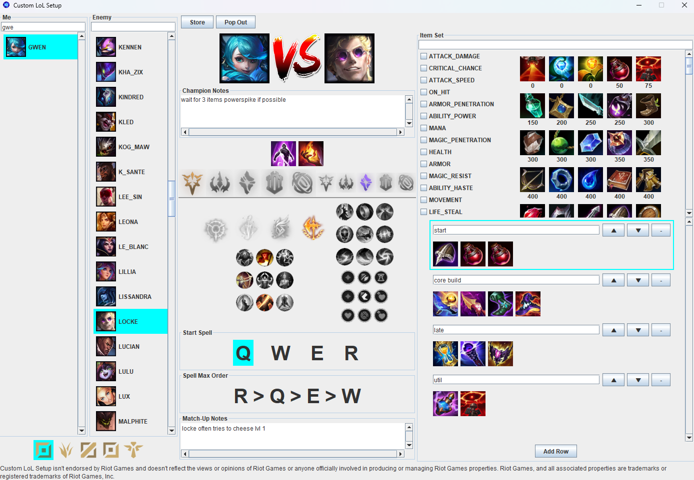

# Custom Runes
This tool allows creating any number of rune pages for *League of Legends* and grouping them.
An example usage looks like this:

## TODO
- It is planned to connect the tool with the League Client API to insert the stored rune pages directly into the client
